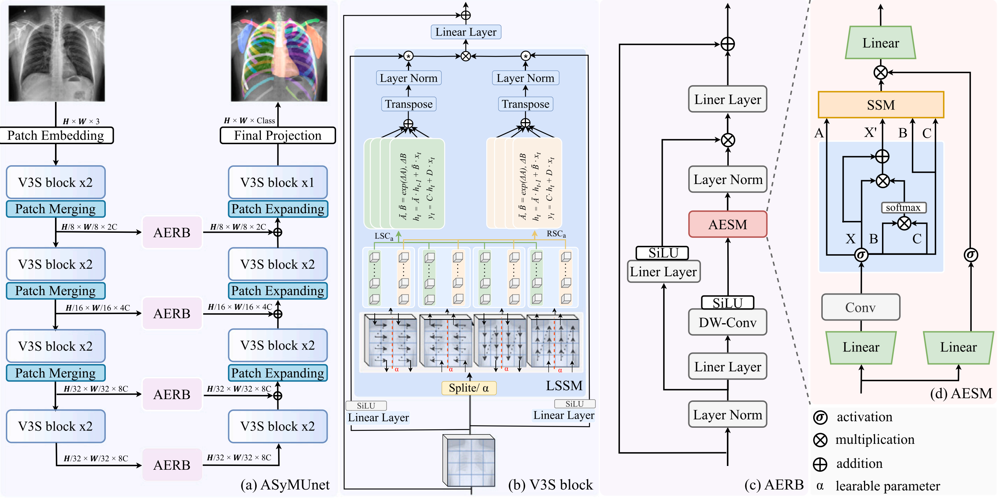

<p align="center"><strong>Medical Image Segmentation via Attention-Enhanced Mamba with Learnable Symmetry Scan and A Benchmark</strong></p><div align="center">
Xiaowei Zhao<sup>1,3</sup>, Chenglong Li<sup>1,3</sup> (Corresponding author), Jin Tang<sup>2</sup>, Chuanfu Li<sup>4</sup> 
</div><div align="center">
<sup>1</sup>School of Artificial Intelligence, Anhui University, Hefei, China <sup>2</sup>School of Computer Science and Technology, Anhui University, Hefei, China <sup>3</sup>State Key Laboratory of Opto-Electronic Information Acquisition and Protection Technology, China <sup>4</sup>The First Affiliated Hospital, Anhui University of Chinese Medicine, Hefei, China 
</div><div align="center"></div>Abstract：In recent years, deep learning has demonstrated strong potential for medical image segmentation, but the task remains challenging due to substantial variations in the shape, texture, and contrast of anatomical structures. While state-space models like Mamba have gained attention for linear computational complexity and global receptive fields, they struggle with complex, irregular medical structures due to 1D sequential processing. When extending Mamba to highly complex medical images (e.g., chest X-rays), two issues arise:🔥1. How can Mamba overcome the limitations of single-order sequential processing to avoid error accumulation in highly interleaved anatomical structures? 🔥2. How can we leverage the inherent symmetry of anatomical structures as an end-to-end learnable prior rather than a post-processing step? To address these issues, we propose a novel Attention-enhanced Mamba with learnable Symmetric scan mechanism network (ASyMnet). Our key idea is to exploit bilateral symmetry to decouple feature maps, enabling parallel and structure-consistent context aggregation via four-directional scanning. To achieve this, we introduce the Learnable Symmetric Scanning Mechanism (LSSM), which learns a symmetry axis to adaptively decouple the features. Furthermore, we propose an Attention-Enhanced State-Space Module (AESM) to enrich global context representations by incorporating self-attention directly into the state-space formulation.

Additionally, we present LaXAS, a large-scale chest X-ray segmentation dataset with 6,289 annotated images across 32 anatomical structures. 
Extensive experiments demonstrate that ASyMnet achieves state-of-the-art performance on LaXAS, CXRS, and Synapse datasets.
 

## Framework

<div align="center">
    
</div>

## Code Structure Illustration

For the core model components, we implement the Mamba-based architecture in `models/ASyMnet.py`. The Learnable Symmetric Scanning Mechanism (LSSM) and Visual Symmetric Decoupled State-Space Block (V3SBlock) are defined within the network building blocks. The Attention-Enhanced State-Space Module (AESM) is integrated into the skip connections to refine multi-scale features during the decoding process.
## Preparation

### Environment Setup

1. Create a new Conda environment and activate it:
    ```bash
    conda create -n asymnet python=3.8 
    conda activate asymnet
    ```

2. Install PyTorch and related libraries (we used PyTorch 2.1 with CUDA support):
    ```bash
    pip install torch==2.1.1+cu118 torchvision==0.16.1+cu118 torchaudio==2.1.1+cu118
    ```
3. Install Mamba and related libraries:
    ```bash
    pip install packaging
    pip install timm==0.4.12
    pip install pytest chardet yacs termcolor
    pip install submitit tensorboardX
    pip install triton==2.0.0
    pip install causal_conv1d==1.0.0  # causal_conv1d-1.0.0+cu118torch1.13cxx11abiFALSE-cp38-cp38-linux_x86_64.whl
    pip install mamba_ssm==1.0.1  # mmamba_ssm-1.0.1+cu118torch1.13cxx11abiFALSE-cp38-cp38-linux_x86_64.whl
    pip install scikit-learn matplotlib thop h5py SimpleITK scikit-image medpy yacs
    ```
4. Install additional dependencies (including Mamba environments):
    ```bash
    pip install -r requirements.txt
    ```

---

## Run

### Data Preparation

1. Download the **Synapse** datasets and place them into the `dataset/` directory.


### Running the Model

1. Execute the following command to start training the model:
    ```bash
    python train_synapse.py 
    ```
2. 🚨 <span style="color:red;">ATTENTION!!!</span> 🚨
 When training on the Synapse dataset (3D abdominal CT scans without clear bilateral symmetry), the LSSM module should be disabled, and only the AESM module is utilized within the AERB skip connections.

## Acknowledgements

🤝 Our work is built upon the foundational progress of **Mamba** and **VM-UNet**. Thanks to their open-source contributions to the community!

## References

If you find this project or the LaXAS dataset helpful, please consider citing our paper:
```bibtex
@article{ZHAO2026113680,
title = {Medical image segmentation via Attention-enhanced Mamba with learnable Symmetry scan and a benchmark},
journal = {Pattern Recognition},
volume = {179},
pages = {113680},
year = {2026},
issn = {0031-3203},
doi = {https://doi.org/10.1016/j.patcog.2026.113680},
url = {https://www.sciencedirect.com/science/article/pii/S003132032600645X},
author = {Xiaowei Zhao and Chenglong Li and Jin Tang and Chuanfu Li},
}
